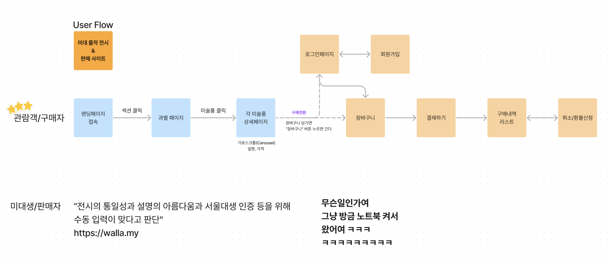

# 📖 SNU_GraduART 서비스앱 README

- 배포 URL :
- 레파지토리 링크 : https://github.com/hoooooojjjj/SNU_GraduART

 

## 개발 시 주의사항

### [👉 개발 규칙 링크](./README/README/DevRule.md)

## 개발 컨벤션

### [👉 개발 컨벤션 링크](./README/README/codeConvention.md)

## Emotion 가이드

### [👉 Emotion 가이드 링크](./README/README/Emotion.md)

## 폴더 구조

### [👉 폴더 구조 정리 링크](./README/README/folderStructure.md)

 

## 프로젝트 소개

~

## 프로젝트 개발 과정

### 1. 비지니스 캔버스

### 2. Userflow

### 3. 디자인

### 👉 <a href="https://www.figma.com/design/DB7PzkEtJeUpEjSfH1s68H/%ED%95%B4%EC%BB%A4%ED%86%A4-SNU-GraduART?node-id=149-84862&t=OQIBS7yHN1FCFXLh-0">피그마 링크</a>

### 4. ERD / API 명세

### 👉 <a href="https://www.figma.com/board/TSTx7P0laHRFzgxdNLoN4n/%EB%AF%B8%EB%8C%80-%EC%A1%B8%EC%9E%91-%ED%8C%90%EB%A7%A4-%EC%82%AC%EC%9D%B4%ED%8A%B8?node-id=0-1&t=ZUhwNUFAk1RXNUBh-0">피그잼 링크</a>

## 프로젝트 레퍼런스

### 피그마 아이콘 관련

- <a href="https://ant.design">AntDisign</a>
- <a href="https://www.svgrepo.com/">svgrepo</a>
- <a href="https://iconify.design/">iconify</a>

### 애니메이션 효과 관련

- 기본 애니메이션 ⇒ <a href="https://animista.net/">animista</a>
- 전환 ⇒ <a href="https://www.moma.org/">MoMA</a>에다가 <a href="https://meum.me/">믐</a>처럼 애니메이션 더하기

### 디자인 전반 관련

- <a href="https://www.wart.co.kr/?gcl_keyword=미술그림&gcl_network=g&gad_source=1&gclid=CjwKCAjwp4m0BhBAEiwAsdc4aEQd8t41Wj5NBY6qeTOTOIewYmO-pe5Cryr6qbOJENjj8VzWDXIWzxoCbuMQAvD_BwE">WeART</a>
- <a href="https://www.getty.edu/art/">게티 메인</a>
- <a href="https://www.getty.edu/art/exhibitions/marvels/">게티 상세</a>
- <a href="https://www.mmca.go.kr/">국립현대미술관</a>
- <a href="https://www.gallery360.co.kr/">갤러리 360</a> ⇒ 메타버스 레퍼런스

### [1] 랜딩페이지

- <a href="https://www.moma.org/">MOMA</a> ⇒ 동양화과/서양화과 등 과별 배너 마련
- <a href="https://qshop.ai/template?utm_source=google&utm_medium=cpc&utm_campaign=search_keyword_webbuilder_dsa&gad_source=1&gclid=CjwKCAjwp4m0BhBAEiwAsdc4aDbvfmaxjXQAlzjqDBpuvQvUMYKRT1SQgvlu6Qk17e27Rc8y3jwHIBoCsKsQAvD_BwE">큐샵</a> > 생활/잡화 > 스페이스 리빙 콜렉션

### [2] 과별페이지

- <a href="https://www.moma.org/calendar/exhibitions/5616">MOMA</a> ⇒ 컨셉이 전체 화면에 보이게

### [3] 각 미술품 상세페이지

- 애니메이션 참고, 액자 형식 + 액자 밑에 해설
- 아래 디자인으로 상세 페이지 만들고 옆으로(carousel) 넘기면 벽과 액자에 애니메이션을 줘서 옆으로 넘어가고 슥슥 넘기면서 1인칭 시점으로 전시회에서 다음 작품으로 넘어가는 것처럼 보이게

   

  

### Else

- <a href="https://art.snu.ac.kr/artexhibition/?cate[0]=20231&cate[1]=&cate[2]=&cate[3]=&cate[4]=">서울대학교 미술대학 졸업작품</a>
- 판매자 관련 설문조사 : <a href="https://home.walla.my/">왈라왈라
  </a>
- <a href="https://www.opengallery.co.kr/exhibition/">이런 느낌</a>은 아니었으면...

 

## 팀원 구성

|                                                    **김대유**                                                    |                                               **김민석**                                               |                                                   **박민서**                                                   |                                                   **유호준**                                                    |
| :--------------------------------------------------------------------------------------------------------------: | :----------------------------------------------------------------------------------------------------: | :------------------------------------------------------------------------------------------------------------: | :-------------------------------------------------------------------------------------------------------------: |
| [   @Mushroombud](https://github.com/Mushroombud) | [   @minss7](https://github.com/minss7) | [   @charijyard](https://github.com/charijyard) | [   @hoooooojjjj](https://github.com/hoooooojjjj) |

 

## 1. 개발 환경

- Front : HTML, JavaScript, React, Emotion(css)
- Back-end : Supabase
- 버전 및 이슈관리 : Github, Github Issues, Github Project
- 협업 툴 : 채널톡, Notion
- 서비스 배포 환경 :
- 디자인 : Figma , Mui

   

## 2. 채택한 개발 기술과 브랜치 전략

### React, Emotion

- React

- Emotion

### eslint, prettier

- 정해진 규칙에 따라 자동적으로 코드 스타일을 정리해 코드의 일관성을 유지하고자 했습니다.
- 코드 품질 관리는 eslint에, 코드 포맷팅은 prettier에 일임해 사용했습니다.
- airbnb의 코딩 컨벤션을 참고해 사용했고, 예외 규칙은 팀원들과 협의했습니다.
- 협업 시 매번 컨벤션을 신경 쓸 필요 없이 빠르게 개발하는 데에 목적을 두었습니다.

 

## 3. 프로젝트 구조

 

## 4. 역할 분담

### 김대유

- **UI**
  - 페이지 : 홈, 검색, 게시글 작성, 게시글 수정, 게시글 상세, 채팅방
  - 공통 컴포넌트 : 게시글 템플릿, 버튼
- **기능**
  - 유저 검색, 게시글 등록 및 수정, 게시글 상세 확인, 댓글 등록, 팔로워 게시글 불러오기, 좋아요 기능

 
    
### 김민석

- **UI**
  - 페이지 : 프로필 설정, 프로필 수정, 팔로잉&팔로워 리스트, 상품 등록, 상품 수정, 채팅 목록, 404 페이지
  - 공통 컴포넌트 : 탭메뉴, InputBox, Alert 모달, 댓글
- **기능**
  - 프로필 설정 및 수정 페이지 유저 아이디 유효성 및 중복 검사, 상품 등록 및 수정

 

### 박민서

- **UI**
  - 페이지 : splash 페이지, sns 로그인 페이지, 로그인, 회원가입
  - 공통 컴포넌트 : 상품 카드, 사용자 배너
- **기능**
  - splash 페이지, sns로그인 페이지, 로그인 유효성 및 중복 검사, 회원가입 유효성 및 중복 검사, 이메일 검증, 프로필 설정, 접근제한 설정

 

### 유호준

- **UI**
  - 페이지 : 사용자 프로필 페이지
  - 공통 컴포넌트 : 탑배너, 하단 모달창
- **기능**
  - 팔로우 & 언팔로우, 로그아웃, 하단 모달창, 댓글 삭제, 게시글 삭제, 상품 삭제, 사용자 게시글 앨범형 이미지, 탑 배너 뒤로가기 버튼, Alert 모달

 

## 5. 개발 기간 및 작업 관리

### 개발 기간

- 전체 개발 기간 : 2024-07- ~
- UI 구현 : 2024-07- ~
- 기능 구현 : 2024-07- ~

 

### 작업 관리

- GitHub Projects와 Issues를 사용하여 진행 상황을 공유했습니다.
- 주간회의를 진행하며 작업 순서와 방향성에 대한 고민을 나누고 GitHub Wiki에 회의 내용을 기록했습니다.

 

## 6. 신경 쓴 부분

- [접근제한 설정](https://github.com/likelion-project-README/README/wiki/README-6.%EC%8B%A0%EA%B2%BD-%EC%93%B4-%EB%B6%80%EB%B6%84_%EC%A0%91%EA%B7%BC%EC%A0%9C%ED%95%9C-%EC%84%A4%EC%A0%95)

- [Recoil을 통한 상태관리 및 유지](https://github.com/likelion-project-README/README/wiki/README-6.%EC%8B%A0%EA%B2%BD-%EC%93%B4-%EB%B6%80%EB%B6%84_Recoil%EC%9D%84-%ED%86%B5%ED%95%9C-%EC%83%81%ED%83%9C%EA%B4%80%EB%A6%AC-%EB%B0%8F-%EC%9C%A0%EC%A7%80)

 

## 7. 페이지별 기능

<b style='font-size:18px'>[메인페이지]</b>
 

<li>서비스 접속 초기화면으로 배경사진과 텍스트가 나타납니다.
<video controls src='https://github.com/user-attachments/assets/66714aec-22de-49b4-b3ff-d964afa6bb6a'></video></li>
 

<li>메인페이지에서 아래로 스크롤 시 과별 배너의 텍스트 컨테이너가 나타납니다.
<video controls src='https://github.com/user-attachments/assets/6ee0f8f1-0212-4c05-824b-5f15aa564a74'></video>
</li>
 
<li>헤더의 검색 아이콘 클릭시 메인페이지 하단의 검색창으로 이동하고, 작가와 작품이름 검색이 가능합니다.</li>
<video controls src='https://github.com/user-attachments/assets/c2faed87-fd09-48df-b4b7-d4880cb61710'></video>

 
<li>검색결과를 클릭시 해당 작품의 상세페이지로 이동합니다.</li>
 
<li>헤더의 장바구니 아이콘 선택시</li> 
<ul>
<li>로그인이 되어 있지 않은 경우: 로그인 페이지로 이동</li>

 
<li>로그인이 되어 있는 경우: 장바구니 페이지로 이동</li>

 
<li>헤더의 마이페이지 아이콘 선택시 -로그인이 되어 있지 않은 경우: 로그인 페이지로 이동
</li>
 
<li>로그인이 되어 있는 경우: 마이페이지로 이동
</li> </ul>
 
 

<b style='font-size:18px' >[과별페이지]</b>
 

<li>메인페이지에서 과별 배너 클릭시 해당 과의 과별페이지로 이동합니다.
<video controls src='https://github.com/user-attachments/assets/88114b31-ec4f-48ff-ad0d-3ae1e87e98d5'></video></li>
 
<li>해당 과에 대한 설명과 관련 사이트의 링크가 있습니다.
</li>
 
<li>과별페이지 하단에서 해당 과의 작품을 확인할 수 있고, 클릭시 해당 작품의 상세페이지로 이동합니다.
<video controls src='https://github.com/user-attachments/assets/734697e5-fd41-4b1e-a2ab-a4e334022a6d'></video></li>

 
 
<b style='font-size:18px'>[상세페이지]</b>

<li>상세페이지에선 작품에 대한 간략한 설명과 함께 해당 작품에만 집중할 수 있도록 하였습니다.

<video controls src='https://github.com/user-attachments/assets/8015b8b2-ae53-4243-ac9a-289f4ccd78db'></video>양옆의 화살표 클릭시 다른 작품(동일 과)에 대한 상세페이지로 넘어갑니다.</li>

</li>

  
<li>하단의 구매 정보 클릭시
<ul>
  <li>구매되지 않은 상품인 경우: 작품의 가격과 장바구니 담기 텍스트가 나타납니다.

</li>
 
<li>이미 구매된 상품일 경우: 작품의 가격과 판매 완료 텍스트가 나타납니다.

</li></ul>

 

<li>장바구니 담기 선택시 
<ul>
<li>자신의 장바구니에 담겨있지 않은 상품인 경우: 해당 작품이 장바구니에 담기고, 계속 관람하기와 장바구니 보기 버튼이 포함된 모달창이 나타납니다.
</li>
 
<li>장바구니 보기 클릭 시: 장바구니 페이지로 이동합니다.
<video controls src='https://github.com/user-attachments/assets/87f66cb1-b59e-4d6b-af8a-cf8e4e129c2a'></video>
    
</li>
 
<li>이미 자신의 장바구니에 담겨있는 상품인 경우: 이미 장바구니에 담긴 상품이라는 모달창이 나타납니다.
 </li>
</ul>
 

<b style='font-size:18px'>[장바구니]</b>
 

## 8. 트러블 슈팅

 

## 9. 개선 목표

 

## 10. 프로젝트 후기

### 김대유

 

### 김민석

 

### 박민서

 

### 유호준
